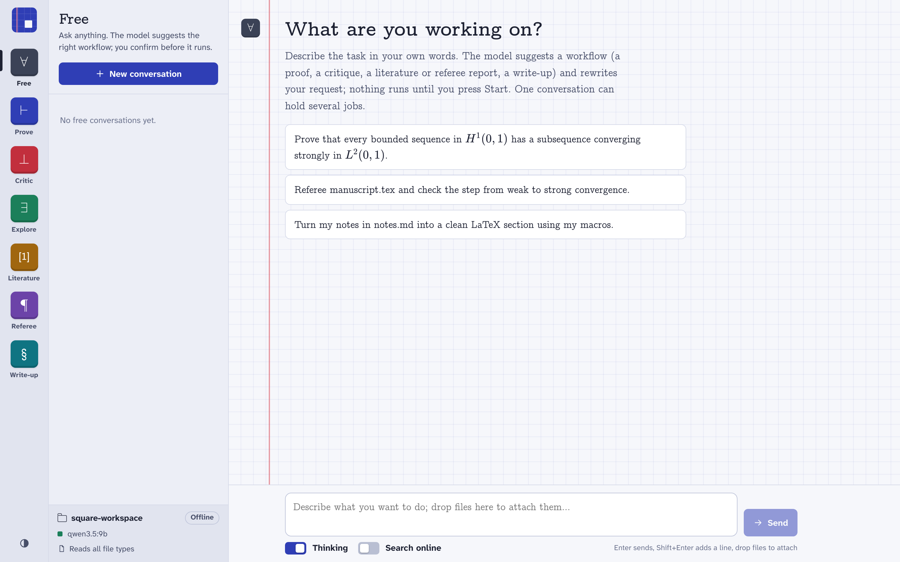

# Square Harness

**An open-source harness for mathematical proof work.**

Square Harness connects a language model to a simple workflow:
**solve → verify → repair when needed**. It preserves the original answer,
reviews the complete proof, and saves every candidate and objection for inspection.

**Version 0.5.1 · experimental.** The priority is a reliable, understandable proof
workflow. A model's approval is not a mathematical certificate; independent
checking remains necessary.

<picture>
  <source media="(prefers-color-scheme: dark)" srcset="docs/images/interface-dark.png">
  
</picture>

## Quick start

You need Python 3.10+, Linux or macOS, and a running model server. Models and their
memory requirements are separate from the harness. Native Windows is not supported.

```bash
git clone https://github.com/vincentboulard/Square-Harness.git
cd Square-Harness
python3 -m venv .venv
source .venv/bin/activate
python -m pip install -e .

ollama pull qwen3.8:27b
mkdir -p ~/research/square-workspace
square-harness --workspace ~/research/square-workspace
```

Start `ollama serve` separately if needed. Choose another installed model with
`--model <exact-tag>`. The default proof profile uses a 40,960-token context;
see the [usage guide](docs/usage.md) for smaller profiles and other servers.

At the prompt:

```text
/prove Prove that every bounded sequence in H¹(0,1) has a subsequence converging strongly in L²(0,1).
/proofs
/proof-report
```

For a problem saved in your workspace:

```bash
square-harness --workspace ~/research/square-workspace \
  --proof-file statement.tex --prompt "Prove the statement in statement.tex."
```

### Visual interface

The same harness also runs as a local web app:

```bash
square-harness --gui --workspace ~/research/square-workspace
```

Your browser opens on `http://127.0.0.1:8765`. Each mode is a notebook in the left
rail, and the Free notebook suggests the right one for each request. Proofs,
critiques, reports and write-ups appear as the model writes them, with typeset
LaTeX, each proof attempt with its review, budgets, citation checks and approval
dialogs for file writes. Drop files onto the window and switch folders from the
sidebar. It uses the same engine, settings and saved jobs as the terminal, including
jobs started there, and works in phone browsers too: see the
[usage guide](docs/usage.md#visual-interface) before exposing it to your network.

## Proof mode

- Give the solver one substantial attempt at the **whole problem**, with thinking enabled.
- Ask a fresh verifier to inspect the full written proof and identify concrete issues.
- Return an approved candidate unchanged; repair or rebut concrete objections.
  An uncertain or unavailable review retains the answer without compulsory rewriting.
- Preserve the initial answer and all revisions. A later fragment cannot silently displace a complete response.
- Bound generated tokens, attempts and time; resume interrupted work with its remaining budget.

The controller and storage are ordinary code. Proof mode has no planner, advisor,
model recorder, tool loop or compulsory rewriting step. Cooperative and portfolio
proof modes are not part of v0.5.

| Command | Purpose |
| --- | --- |
| `/prove <problem>` | Start a saved proof job |
| `/proofs` / `/proof-report <id>` | List jobs or inspect one without inference |
| `/resume <id>` | Resume an interrupted v0.5 job |
| `/critic <question>` / `/explore <question>` | Use ordinary mathematical chat |
| `/writeup <instructions>` | Write up pinned notes as LaTeX in your template style |
| `/help` | Show commands |
| `square-harness --gui` | Open the visual interface instead of the terminal prompt |

Jobs live under `.mathagent/` in the chosen workspace. The `mathagent` command is
an alias; `python -m mathagent` also works from the checkout.

## Guides

- [Usage](docs/usage.md): settings, saved answers, resume, migration from v0.4 and the visual interface.
- [Benchmarks](docs/benchmark.md): direct inference versus proof mode, costs and grading.
- [HyperQwen on A10](docs/hyperqwen-a10.md): the pinned fast serving profile.
- [A10 llama.cpp](docs/a10.md) / [two V100S](docs/ovh.md): retained hardware alternatives.
- [Optional research tools](docs/research.md): manuscript chat, literature and referee drafts, LaTeX write-ups.

Ollama, llama.cpp and OpenAI-compatible servers are supported. The solver and
verifier currently use the same model in separate contexts and can share errors.
Tests check software behaviour; they do not establish mathematical performance.

## Contributing and license

Created by **Vincent Boulard**, with **Louis Carillo**. See
[CONTRIBUTING.md](CONTRIBUTING.md), [CITATION.cff](CITATION.cff) and
[CHANGELOG.md](CHANGELOG.md). Maintainers decide which contributions are merged.

[Apache License 2.0](LICENSE): free scientific and commercial reuse under its terms.
Model weights, dependencies and retrieved papers retain their own licenses.
See [NOTICE](NOTICE) for attribution.
